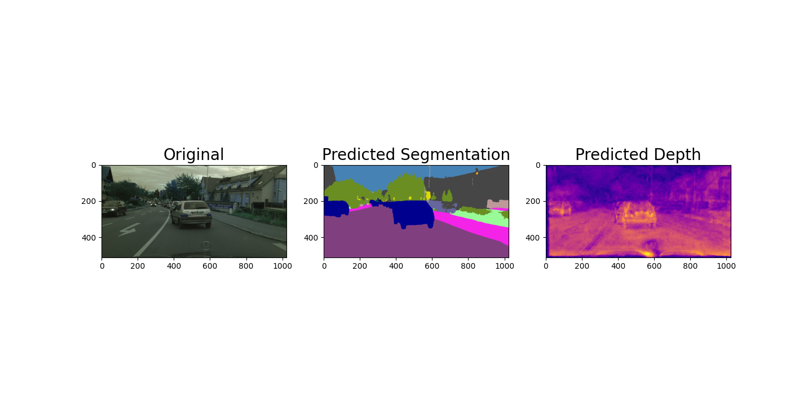

## SEGFORMER3D

Welcome to the enhanced Segformer 3D : A Vision Transformer neural network for segmentation and depth estimation using attention mechanism.

This project implements the original Segformer architecture specialized in image segmentation and enhances it to be a multi-task network which also predicts depth, making it Segformer3D. The aim of the project is to optimize an existing neural network which uses attention mechanism to execute multiple tasks. Multi-task neural networks hold significant advantages in systems with low latency requirements.

### Architecture

The segformer network uses an encoder-decoder style architecture, with attention modules integrated in the encoder block. Attention mechanism, in its simplest form works by looking at different parts of the image and deciding which parts are most important for understanding the overall picture. It does this by comparing different parts of the image to each other using something called a "key" and a "query". The key is like a label that describes what is in each part of the image, and the query is like a question that the model is trying to answer. By comparing the key and the query, the attention mechanism can figure out which parts of the image are most important for answering the question.

In the original paper Segformer [[1]](https://arxiv.org/pdf/2105.15203.pdf), the authors describe network to be a cascaded sequence of transformer and downsampling block. The transformer block is an ensemble responsible for implementing attention mechanism.

1. Overlap patch embedding: This module is responsible for dividing the input image into smaller blocks for attention mechanism to focus on independently and estimate important features.
2. Efficient self attention : This module uses query, key and value vectors to extract features from different parts of image in parallel and assigns them weights on the basis of how relevant they are to understanding the context of the image.
3. Overlap patch merging : This module combines the output of multiple transformer blocks into a single output. It does so by overlaying the outputs of the different transformer blocks on top of each other, with a certain amount of overlap between the blocks.
4. Mix FFN : This module is used to process the output of the transformer blocks and make final predictions based on this output. 

The decoder module is a straightforward MLP architecture that upsamples the encoded vector by utilizing features from hidden layers of the encoder.

This project modifies the original Segformer architecture to integrate an additional decoder block that shares the encoded vector to upsample it to produce a depth estimation map. Furthermore, the loss function is required to be modified from Cross Entropy loss to Cross Entropy + MSELoss.

### Results

Carrying out Inference on a single image 

This architecture is a Vision Transformer at its core using attention mechanism. Visualizing the output from difference attention blocks at different stages helps in a gaining a better understanding of how the model is recognizing the important features which need to focussed on. Following is the vizualization from attention layers.

It is interesting to vizualize how differenct attention heads in different stages are able to focus on different aspects of the input image. For example attention head at 2nd column 1st row is able to focus on road and trees, similarly th3 attention head in 4th column of 1st row is learning to focus on cars and traffic lights.

### Dependencies

Numpy
OpenCV
PyTorch
Einops
Timm

### Instructions

Clone the repository
`git clone https://github.com/adithyagaurav/Segformer3D`

Download the dataset from [link](https://drive.google.com/drive/folders/16wql9YhBGNuXt2c_xk8cWX8z-gqNgr_s?usp=share_link) and place it in the `data/` folder

Download the weights from [link](https://drive.google.com/file/d/1MY9JbKJ3mmx-fE1sc2rQG-76tClH9_q6/view?usp=share_link) and place it in the `weights/` folder

Download the test video from [link](https://drive.google.com/file/d/1vTAh8DTrzBtDs69vuqa5l4cChHwDxgzL/view?usp=share_link) and place it in the `video/` folder

Download the backbone pertained weights from link

To run inference on a single image
`python3 src/test.py --weights <path to weights downloaded> --image_dir <path to folder containing the image>`

To run inference on video
`python3 src/test_video.py --weights <path to weights downloaded> --video <path to the inference video`>

To train the network using pretrained imagenet weights
`python3 src/train.py --weights <path to weights downloaded> --data_dir <path to data_seg_depth folder downloaded>`
